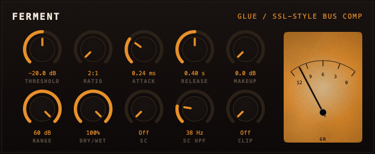
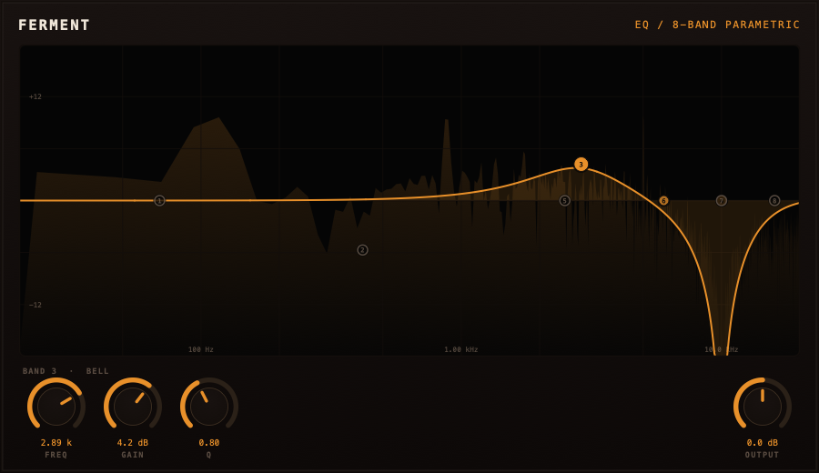
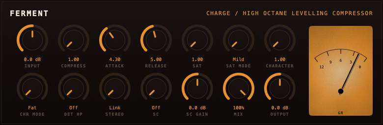
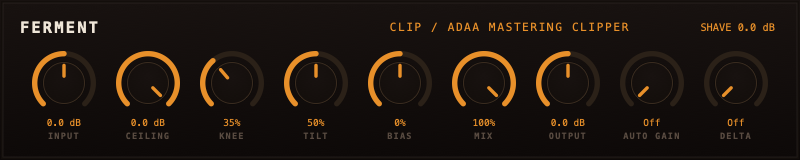
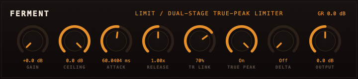
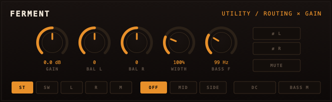

# Ferment

[](https://github.com/dimitrikochnev/ferment-family/actions/workflows/build.yml)
[](./LICENSE.md)

**A warm-analog plugin family for people who master loud and listen close.
Six processors, one signal-chain philosophy: get dense without getting flat.**

- **VST3 / AU / CLAP / Standalone**, macOS (arm64 + Intel) and Windows.
- **Pure C++ DSP core** with a thin JUCE shell — the same engines run
  headless on iOS.
- **Vector UI**, one design language across the family: dark face, amber
  arcs, a needle that actually breathes.
- **Tested like it matters** — every DSP claim in this repo is backed by a
  test you can run.

---

## The family

### Glue — SSL-style bus compressor

The "make a mix sound like a record" device: feedback-style detection and
the famous programme-dependent Auto release. Two dB on the needle, and
everything belongs together.



### EQ — eight bands with a real graph

Drag the nodes, scroll the Q, watch the spectrum move under the curve.
The drawn response is verified against the DSP to a tenth of a dB.



### Charge — high octane levelling compressor

A vari-mu-style leveller with a saturator and spectral shaper on board.
No threshold, no knee — one knob of *more*. Runs parallel beautifully:
dry punch on top, saturated weight underneath. [Read the doc.](docs/CHARGE.md)



### Clip — ADAA mastering clipper

Shaves transients so your limiter stops flinching. Morphing knee, tilt
clipping that keeps bass from eating the midrange, a bias knob for tube-ish
even harmonics — and alias suppression that holds up under real drive.
[Read the doc.](docs/CLIP.md)



### Limit — dual-stage true-peak limiter

Two stages instead of one envelope: a transient bound that mathematically
cannot overshoot, riding on a sustain floor with crest-factor auto-release.
Short hits never pump the level; sustained bass never breathes.
[Read the doc.](docs/LIMIT.md)



### Utility — the housekeeping

Gain, phase, width, mid/side solo, DC filter, bass mono. The boring plugin
you end up using on every track.



---

## The chain

The family is designed to be used in this order on a master bus:

```
Utility  →  Charge  →  EQ  →  Clip  →  Limit
staging     density     tone    shave    ceiling
```

Clip runs its ceiling ~0.5 dB above Limit's: the clipper does the fast
work, the limiter only rounds what the knee lets through.

## Install

Grab the latest build from
[Actions](https://github.com/dimitrikochnev/ferment-family/actions):

- **macOS** — `ferment-family-<version>-macos-universal.dmg`, a single
  installer with per-plugin choices (VST3 + AU).
- **Windows** — `ferment-family-<version>-windows-x64.zip`, drop the
  `.vst3` folders into `C:\Program Files\Common Files\VST3`.

## Build from source

```
cmake -B build && cmake --build build -j 8
ctest --test-dir build
```

First configure fetches JUCE 8 and clap-juce-extensions. On macOS,
`COPY_PLUGIN_AFTER_BUILD=TRUE` (default) installs into your user plugin
folders as you build.

## Documentation

- **[Charge](docs/CHARGE.md)** · **[Glue](docs/GLUE.md)** ·
  **[Clip](docs/CLIP.md)** · **[Limit](docs/LIMIT.md)** — what each knob
  does and why
- **[UI spec](docs/UI_SPEC.md)** — the component kit behind the faceplates

---

## License

MIT © LockVoid Labs ~●~
